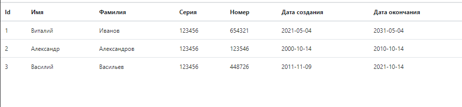
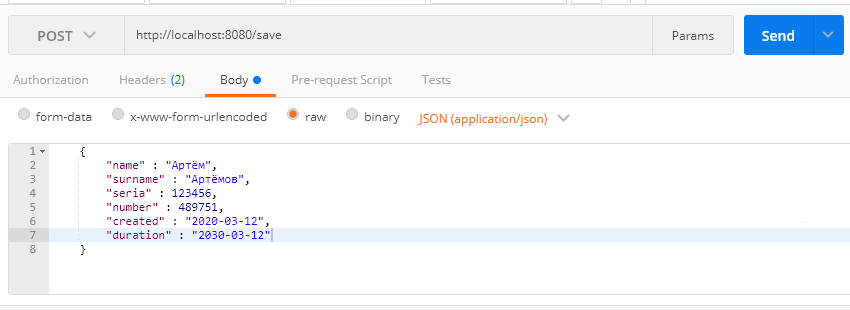
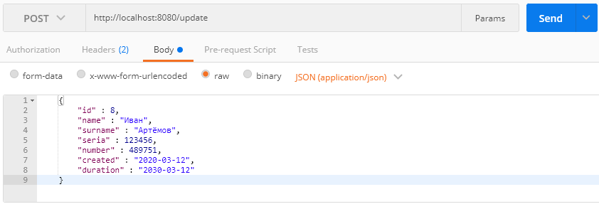
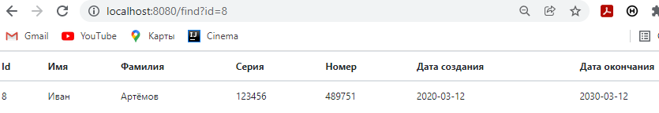
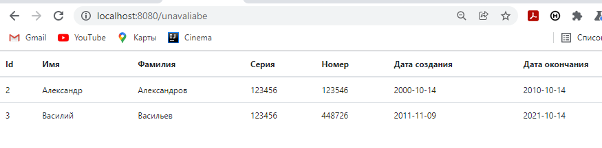
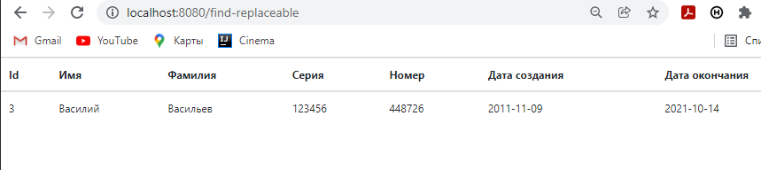

# Passport_control
 Passport_control -  это web сервис, который внутри себя имеет микросервисную архитектуру. В данном приложении происходит взаимодействие сервиса на основе Spring Boot и сервиса на основе REST API. Сервис на основе Spring Boot общается с клиентом и передаёт ему информацию, а сервис на основе REST API выполняет всю бизнес-логику.   
 Passport_control позволяет добавлять информацию о паспортных данных пользователя, редактировать её, а также получать информацию о паспортах с истёкшим сроком действия и информацию о паспортах, которые истекают в ближайшие 3 месяца.
 
 ### Получение всех паспортов
Для получения информации о всех паспортах, необходимо обратиться к сервису GET запросом (http://localhost:8080/)    
       
  
 ### Добавление паспорта
Для добавления нового паспорта необходимо отправить на сервис POST запрос (http://localhost:8080/save) со всей необходимой информацией.     
        
  
 ### Изменение паспорта
Для изменения паспорта необходимо отправить на сервис POST запрос (http://localhost:8080/update) со всей необходимой информацией    
        
  
 ### Получение паспорта
Для получения ***всех*** паспортов необходимо отправить на сервис GET запрос (http://localhost:8080/find)   
        
Для получения ***конкретного*** паспорта необходимо отправить на сервис GET запрос с id соответствующего паспорта (http://localhost:8080/find?id={нормер id})   
        
  
 ### Удаление паспорта
Для удаления паспорта из сервиса необходимо отправить на сервис POST запрос (http://localhost:8080/delete/{id}) с указанием в запросе соответствующий id.  

 ### Получения паспортов с истёкшим сроком годности
Для получения паспортов с истёкшим сроком годности необходимо отправить на сервис GET запрос (http://localhost:8080/unavaliabe).     
      

 ### Получения паспортов, которые нужно заменить в ближайшие 3 месяца
Для получения паспортов, которые заканчиваться в ближайшие 3 месяца необходимо отправить на сервис GET запрос (http://localhost:8080/find-replaceable).     
      
  
 На основе брокера сообщений (Kafka) в сервисе реализована система периодической отправки уведомлений о паспортах с истёкшим сроком действия и паспортах, у которых срок действия заканчивается менее чем 3 месяцев.  
 
### При реализации использовано:
* JDK 14
* Maven 3
* Spring MVC
* Spring REST 
* Spring Data
* PostreSQL
* JUnit
* Liquibase
* Kafka
* Scheduled